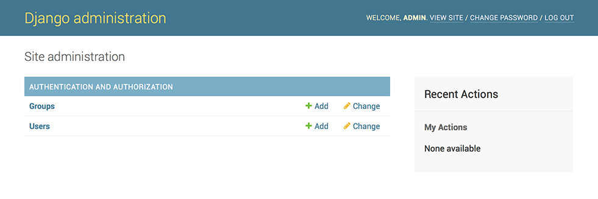

## Playing with the API

```commandline
Playing with the API
We’re using this instead of simply typing “python”, because manage.py sets the DJANGO_SETTINGS_MODULE environment variable, which gives Django the Python import path to your mysite/settings.py file.

>>> from polls.models import Choice, Question  # Import the model classes we just wrote.

# No questions are in the system yet.
>>> Question.objects.all()
<QuerySet []>

# Create a new Question.
# Support for time zones is enabled in the default settings file, so
# Django expects a datetime with tzinfo for pub_date. Use timezone.now()
# instead of datetime.datetime.now() and it will do the right thing.
>>> from django.utils import timezone
>>> q = Question(question_text="What's new?", pub_date=timezone.now())

# Save the object into the database. You have to call save() explicitly.
>>> q.save()

# Now it has an ID.
>>> q.id
1

# Access model field values via Python attributes.
>>> q.question_text
"What's new?"
>>> q.pub_date
datetime.datetime(2012, 2, 26, 13, 0, 0, 775217, tzinfo=datetime.timezone.utc)

# Change values by changing the attributes, then calling save().
>>> q.question_text = "What's up?"
>>> q.save()

# objects.all() displays all the questions in the database.
>>> Question.objects.all()
<QuerySet [<Question: Question object (1)>]>

```

<Question: Question object (1)> isn’t a helpful representation of this object. Let’s fix that by editing the Question model (in the polls/models.py file) and adding a __str__() method to both Question and Choice:

polls/models.py
```commandline
from django.db import models

class Question(models.Model):
    # ...
    def __str__(self):
        return self.question_text

class Choice(models.Model):
    # ...
    def __str__(self):
        return self.choice_text
```

## Django admin site
One of the most powerful parts of Django is the automatic admin interface. It reads metadata from your models to provide a quick, model-centric interface where trusted users can manage content on your site.
### Creating an admin user
First we’ll need to create a user who can login to the admin site. Run the following command:
```
$ python manage.py createsuperuser
```
Enter your desired username and press enter.
```
Username: admin
```
You will then be prompted for your desired email address:
```
Email address: admin@example.com
```
The final step is to enter your password. You will be asked to enter your password twice, the second time as a confirmation of the first.
```
Password: **********
Password (again): *********
```
Superuser created successfully.
Start the development server
The Django admin site is activated by default. Let’s start the development server and explore it.

If the server is not running start it like so:
```
$ python manage.py runserver 0.0.0.0:8000
```
Now, open a web browser and go to “/admin/” on your local domain
You should see the admin’s login screen:


### Enter the admin site
Now, try logging in with the superuser account you created in the previous step. You should see the Django admin index page:



### Start the development server

> python manage.py runserver 0.0.0.0:8000

At this point of time you will not be able to se the models that you have added

### How do we make  the poll app modifiable in the admin?


##  ModelAdmin objects
1. ### class ModelAdmin
    The ModelAdmin class is the representation of a model in the admin interface. Usually, these are stored in a file named admin.py in your application.
    To do this, open the PollApp/admin.py
   polls/admin.py
```
   from django.contrib import admin
    from myapp.models import Question

    class QuestionAdmin(admin.ModelAdmin):
        pass
    admin.site.register(Question, QuestionAdmin)
   ```


2. ### ModelAdmin.list_filter
    Set list_filter to activate filters in the right sidebar of the change list page of the admin
    
```list_filter = (('pub_date',),)```


3. ### ModelAdmin.search_fields
    Set search_fields to enable a search box on the admin change list page. This should be set to a list of field names that will be searched whenever somebody submits a search query in that text box.
    ```
   search_fields = ['question_text']
   ```

4. ### ModelAdmin.exclude
    This attribute, if given, should be a list of field names to exclude from the form.
    For example, let’s consider the following model:
    
5. ### ModelAdmin.list_display
    Set list_display to control which fields are displayed on the change list page of the admin.
    ```
   class QuestionAdmin(admin.ModelAdmin):
     list_display = ('pub_date',)
   ```


[`Next`](excersise2.md)
